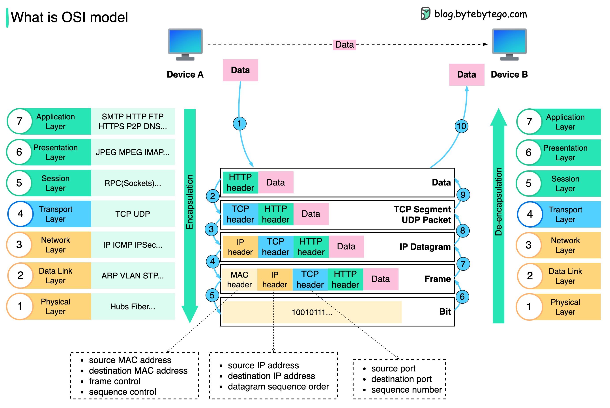
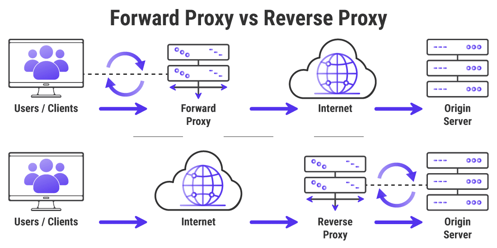

#Application Layers

### 1) OSI Application layers (Open System Interconnection mode):




### 2) Understanding Layer 4 vs Layer 7 Reverse Proxy

(https://harshityadav.in/posts/Understanding-Layer-4-vs-Layer-7-Reverse-Proxy/)

### 3) Layer 4 vs Layer 7 Proxy Mode

https://www.haproxy.com/blog/layer-4-and-layer-7-proxy-mode

Layer 7 – Application: application protocols like HTTP, SSH and SMTP

Layer 6 – Presentation: the character encoding like ASCII vs UTF-8

Layer 5 – Session: mechanisms for establishing point-to-point communication

Layer 4 – Transport: data transfer protocols like TCP and UDP

Layer 3 – Network: network routing protocols like IP and OSPF

Layer 2 – Data Link: protocols that connect the physical layer to the network layer, such as Ethernet and ARP

Layer 1 – Physical: the physical components such as cable wiring and Wi-Fi

#### Layer 4 Proxy Mode
```bash
defaults
    # mode is inherited by sections that follow
    mode tcp

frontend db
    # receives traffic from clients
    bind :3306
    default_backend databases

backend databases
    # relays the client messages to servers
    server db1 192.168.0.10:3306
    server db2 192.168.0.11:3306
```
#### Layer 7 Proxy Mode
```bash
defaults
    # mode is inherited by sections that follow
    mode http   # <====

frontend www
    # receives traffic from clients
    bind :80
    default_backend web_servers

backend web_servers
    # relays the client messages to servers
    server s1 192.168.0.10:3000
    server s2 192.168.0.11:3000
```
